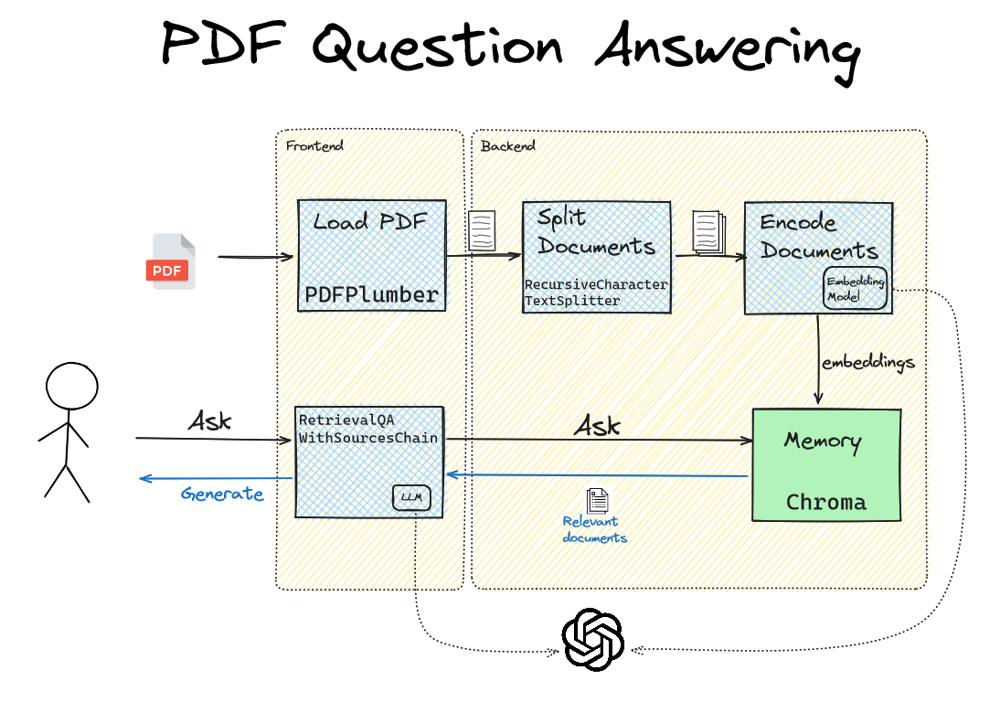

# Workshop 1: PDF Q&A❓ App using OpenAI, Langchain, and Chainlit

This repository contains an introductory workshop for learning LLM Application Development using Langchain, OpenAI, and Chainlist. The workshop goes over a simplified process of developing an LLM application that provides a question answering interface to PDF documents. The prerequisite to the workshop is basic working knowledge of  Git, Linux, and Python. The workshop is organized as follows.

| Lab | Learning Objective | Problem | Solution |
| --- | ------------------ | ------- | :------: |
| 1   | Basic chat with data LLM App  | 🐒 [PDF Q&A Application](https://github.com/leehanchung/llm-pdf-qa-workshop/tree/lab1/main) | ✅ [Solution](https://github.com/leehanchung/llm-pdf-qa-workshop/tree/lab1/pdf-qa-app) |
| 2   | Basic prompt engineering      | 🐒 [Improving Q&A Factuality](https://github.com/leehanchung/llm-pdf-qa-workshop/tree/lab1/pdf-qa-app) | ✅ [Solution](https://github.com/leehanchung/llm-pdf-qa-workshop/tree/lab1/pdf-qa-app-final) |

To run the fully functional application, please checkout [Lab 2 Solution](https://github.com/leehanchung/llm-pdf-qa-workshop/tree/lab1/pdf-qa-app-final) branch and follow the [instruction to run the application](#run-the-application)

The app provides an chat interface that asks user to upload a PDF document and then allow users to ask questions against the PDF document. It uses OpenAI's API for the chat and embedding models, Langchain for the framework, and Chainlit as the fullstack interface.

For the purpose of the workshop, we are using [Gap Q1 2023 Earnings Release](samples/1Q23-EPR-with-Tables-FINAL.pdf) as the example PDF.

The completed application looks as follows:


## 🧰 Stack

- [Python](https://www.python.org/downloads/release/python-3100/)
- [Langchain](https://python.langchain.com/docs/get_started/introduction.html)
- [Chainlit](https://docs.chainlit.io/overview)
- [Chroma](https://www.trychroma.com/)
- [OpenAI](https://openai.com/)

## 👉 Getting Started

We use [Python Poetry](https://python-poetry.org/) for managing virtual environments and we recommend using [pyenv](https://github.com/pyenv/pyenv) to manage Python versions. Alternatively, you can use [Mamba](https://mamba.readthedocs.io/en/latest/) for Python version management.

Install and start the Poetry shell as follows.
```bash
poetry install
poetry shell
```

Please create an `.env` file from `.env.sample` once the application is installed. Edit the `.env` file with your OpenAI org and OpenAI key.
```bash
cp .env.sample .env
```

### Run the Application

Run the application by:
```bash
chainlit run app/app.py -w
```

## Lab 1: Basic chat with data LLM App

The most quintessential llm application is a chat with text application. These type of application uses  a retrieval augmented generation (RAG) design pattern, where the application first retrieve the relevant texts from memory and then generate answers based on the retrieved text.

For our application, we will go through the following steps in the order of execution:

1. User uploads a PDF file.
2. App load and decode the PDF into plain text.
3. App chunks the text into smaller documents. This is because embedding models have limited input size.
4. App stores the embeddings into memory
5. User asks a question
6. App retrieves the relevant documents from memory and generate an answer based on the retrieved text.

The overall architecture is as follows:


Please implement the missing pieces in the [application](app/app.py)

### Lab 1: Solution

2. We choose to use [langchain.document_loaders.PDFPlumberLoader](https://python.langchain.com/docs/modules/data_connection/document_loaders/how_to/pdf#using-pdfplumber) to load PDF files. It helps with PDF file metadata in the future. And we like Super Mario Brothers who are plumbers.
3. We choose to use [langchain.text_splitter.RecursiveCharacterTextSplitter](https://python.langchain.com/docs/modules/data_connection/document_transformers/text_splitters/recursive_text_splitter) to chunk the text into smaller documents.
4. Any in-memory vector stores should be suitable for this application since we are only expecting one single PDF. Anything more is over engineering. We choose to use [Chroma](https://python.langchain.com/docs/modules/data_connection/vectorstores/integrations/chroma).
5. We use [langchain.chains.RetrievalQAWithSourcesChain](https://python.langchain.com/docs/modules/chains/popular/vector_db_qa#return-source-documents) since it returns the sources, which helps the end users to access the source documents.

The completed application has the following architecture:


Now we can [run the application](#run-the-application).

## Lab 2: Basic prompt engineering

Playing around our newly created application using the provided [sample PDF, Gap Q1 2023 Earnings Release](samples/1Q23-EPR-with-Tables-FINAL.pdf), we run into a hallucination problem from the following long  question to ask the model to summarize the key results:
> ```What's the results for the reporter quarter? Please describe in the following order using bullet points - revenue, gross margin, opex, op margin, net income, and EPS. INclude both gaap and non-gaap numbers. Please also include quarter over quarter changes.```

A whooping 36.6% operating margin for a retail business. That is 10x higher than Amazon's consolidated operating margins!!


We again asked the model a simpler and more bounded question:
> ```What's the op margin for the current quarter```


And it finds the answer.

Please resolve this hallucination problem with prompt engineering.

### Lab 2: Solution

✅ [Solution](https://github.com/leehanchung/llm-pdf-qa-workshop/tree/lab1/pdf-qa-app-final)

## LICENSE

This repository is open source under GPLv3 and please cite it as:
```bibtex
@misc{PDF_QA_App_Workshop,
  author = {Lee, Hanchung},
  title = {Workshop 1: PDF Q&A App using OpenAI, Langchain, and Chainlit},
  url = {https://github.com/https://github.com/leehanchung/llm-pdf-qa-workshop},
  year = {2023},
  month = {6},
  howpublished = {Github Repo},
}
```
